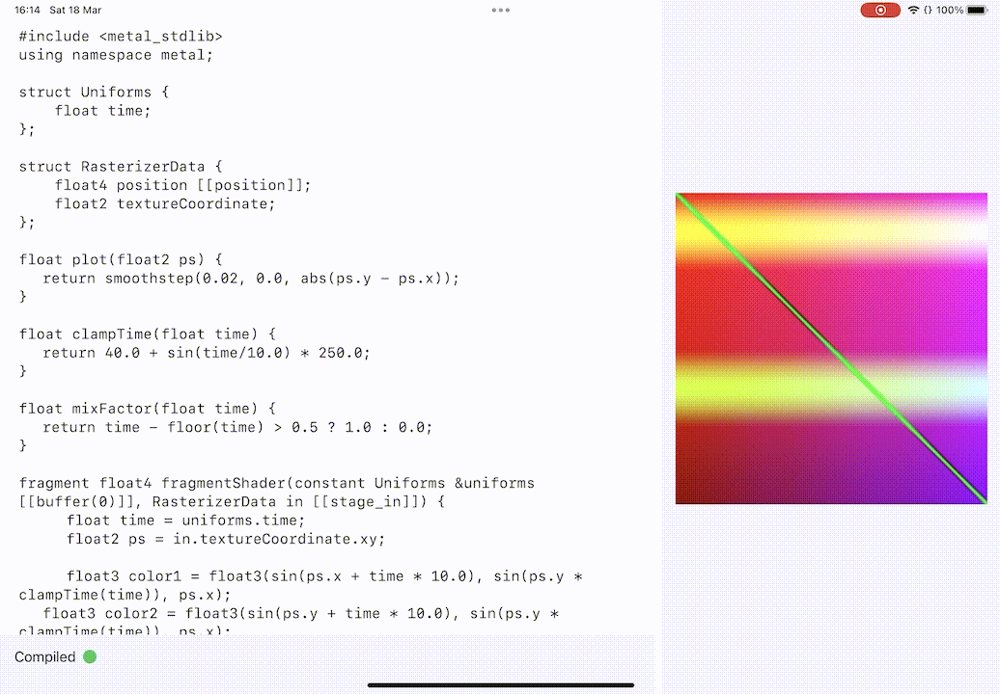

# FragBook
## Fast fragment shader editor for iPad

I made this app in order to be able to learn fragment
shader programming in public transport. Maybe you'll
find it useful.

For now only Metal shaders are supported but I am planning to
add GLSL support in the future using MoltenGL.
